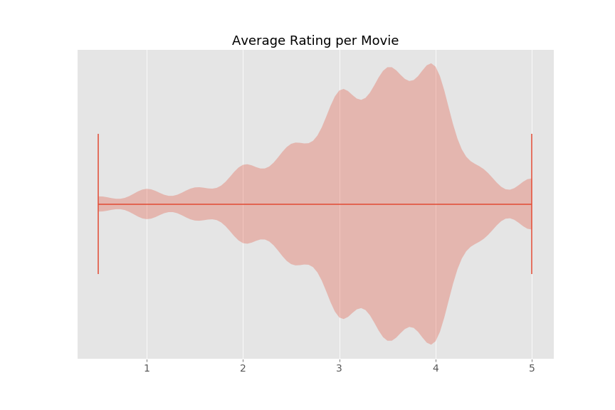
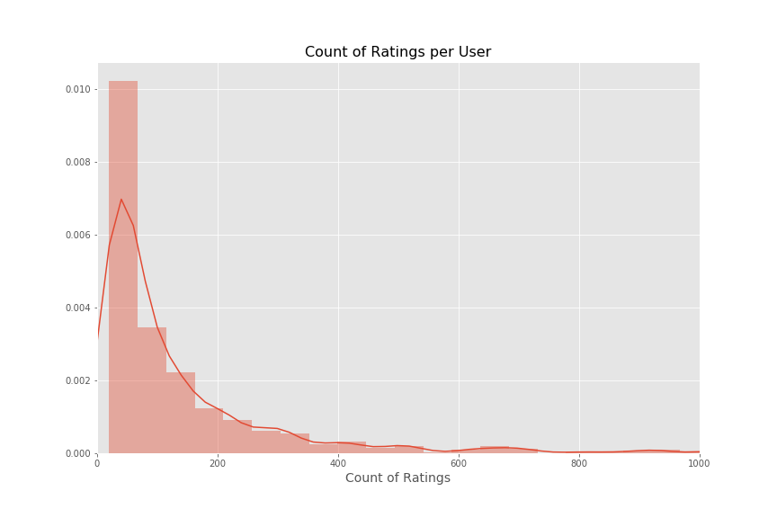
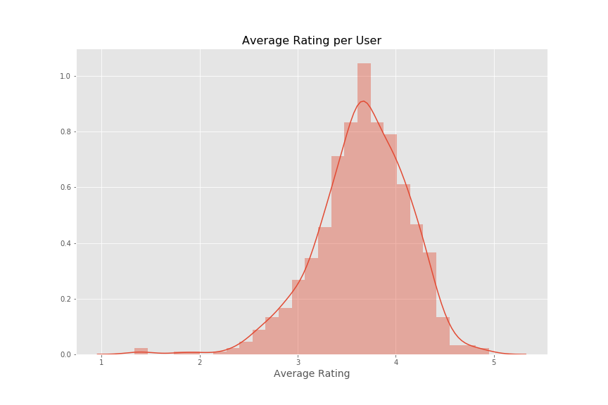
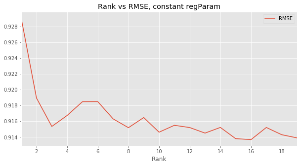

# Recommender Implementation with Spark ALS Collaborative Filtering

### Daniel Kim

 

## The data
MovieLens is a recommender dataset created by GroupLens of the University of Minnesota. The data is composed of over 27 Million ratings from 280,000 users. Reviews of 58,000 movies include a numerical score and may include free-text entries from users as tags. For this case-study, a redacted portion of the dataset was used for development of the recommender.

The reduced dataset consists of 100,000 user reviews from 671 user on over 9,000 movies. While substantial, this data represents a very sparse matrix, with only 1.64% data density in the original data and 1.42% and 0.61% density in the train and test splits, respectively. As a result, a recommender on this system will need to accommodate the sparsity of data--which eliminates several recommender approaches. 

Within the data, there is a non-normal distribution of of ratings of movies, with the majority of ratings falling between 3 - 4 on a scale of 1 - 5 (worst - best). Additionally, an increment of 0.5 within ratings provide a discrete distribution.

 

Surprisingly, very few movies receive a large number of very-low or very-high ratings.

Most users provided fewer than 50 movie ratings which contributes to why the matrix is so sparse. As seen in the below distribution plot, there is a concentration of users who rated 200 or few movies with a much smaller population of users that that rated 200+ movies.

 

When looking at the average rating given by user, the distribution is reasonably normal, showing some left skew, meaning users are more likely to provide favorable ratings on average.

 

## Approach and Analysis
Given the nature of the dataset, two different approaches could be used for a recommender. A content-based recommendation system could be used to recommend movies based on similar features. Movie information and user-entered tags allow for a large corpus that could be used in latent feature analysis. Recommendations would be based on similarities between movies based on latent features, and correlated to user reviews of movies--in order to understand user preferences.

 

Alternatively, a collaborative filtering recommendation system could be used with only the numerical rating data from users for movies. This approach allows for user-user, item-item, and user-item comparisons. The low density of this data, however, restricts the available approaches as sparse data restricts the ability to perform neighborhood-based collaborative filtering. Further, the sheer volume of data in the full data set makes this approach extremely resource-intensive as distances between all movies must be held in memory along with user-user distances.

 

Instead, a non-negative matrix factorization approach allows for the determination of user-embedded and movie-embedded latent factors from the matrix of the user-movie ratings into the matrices U and V. While the factorization approach itself is time-consuming, the results of this matrix factorization allow for the direct prediction of movie ratings for any user. Construction of this user-movie matrix on a sample of the data itself is a time-consuming process, and results in a (671 X 9,066) matrix with 1.64% density. Given the abundance of missing values, typical matrix factorization approaches cannot be used. Instead, a specialized matrix factorization approach known as "Fund SVD" is employed.

 

Funk SVD allows for factorization of incredibly spare matrices because it ignores missing values and only uses present values to compute latent factors. In this approach, values are predicted individually for each user and for each film and compared to a true user rating. For each user, all rated films are used and for each film all ratings are used. A dot-product of these two vectors is used to create a predicted user rating for a film with a true user-rating. This predicted rating is compared to the true user-rating in a cost function, and a gradient descent approach is used to minimize the prediction error. 

The following formula describe the gradient descent for any user (i) and movie (j): 

min( U(i) or V(j) + ⍺ 2(true - predicted) x V(j) or U(i)) , where ⍺ is the learning rate.

For this implementation, the the Spark ALS collaborative filtering recommendation system was the best fit; this way, after the model was trained on a subset of the data, it could be run on a much larger scale with more data. 

In order to determine appropriate hyper-parameters of the Spark ALS model, an initial random Grid Search was performed on approximately 10% of the possible hyper-parameters on the Funk SVD model on training data. A smaller Grid Search was performed using a narrow range of hyper-parameter values. 

Manually performing a random grid search narrowed it down to a rank of 2 and learning rate of 0.15. However, when a full grid search was performed (of rank 1-20), there was a smaller optimal hyper-parameter global minima of 16, albeit more local and thus harder to find manually.  

  

## Conclusion
Using a Spark ALS collaborative filtering recommendation system, with a RMSE of .8366, the baseline recommender was beat by the large margin of 17.8%! More importantly, since the model is built on Spark, it can be scaled to a much larger dataset for production use.  
  
---
> Header image courtesy University of Minnesota
